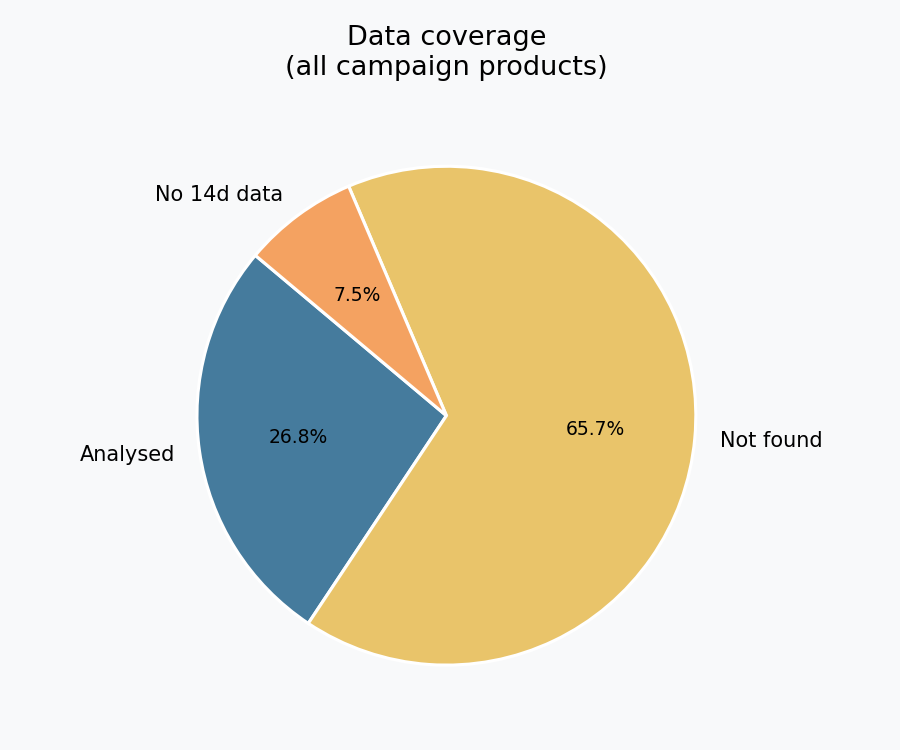
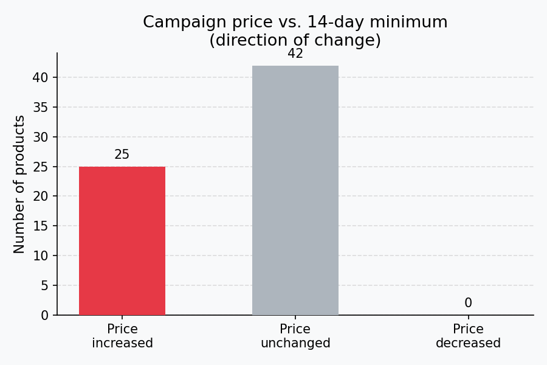
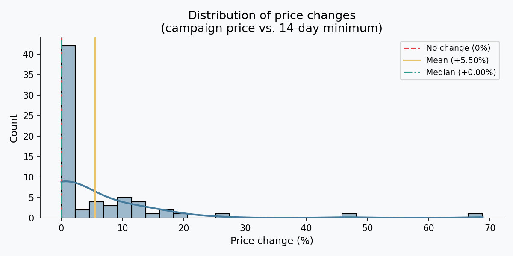
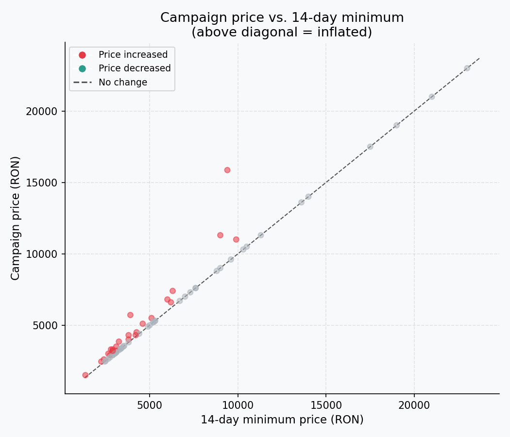
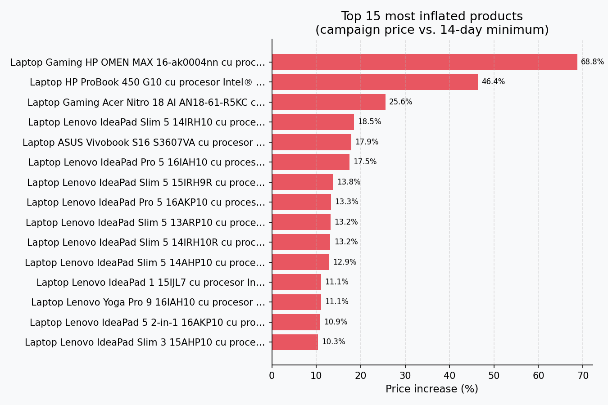
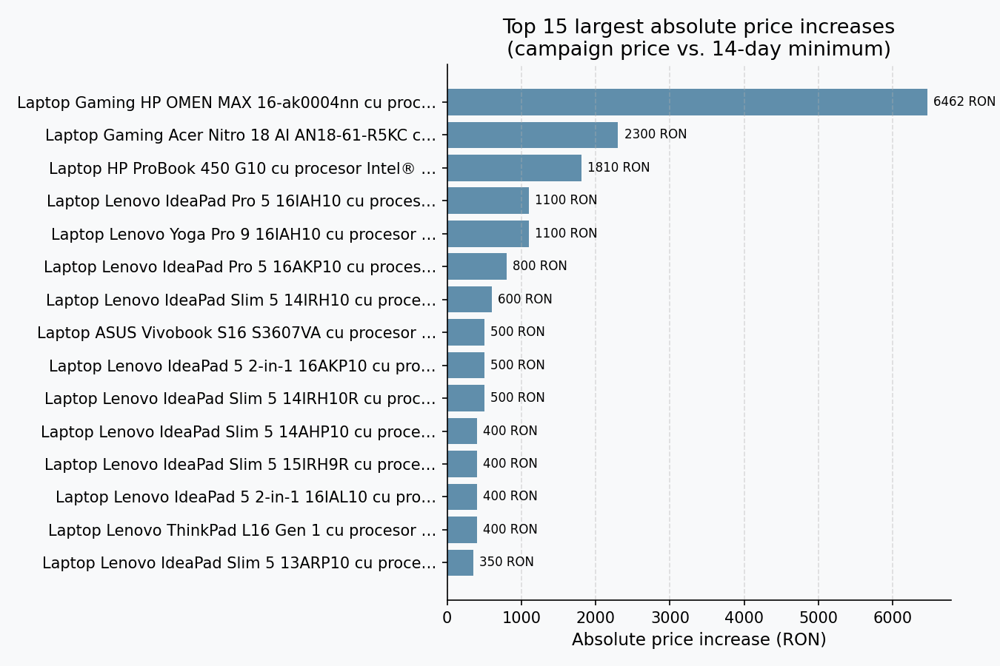

# E-commerce Price Manipulation Analysis

## Hypothesis

Online retailers inflate product prices before making discount vouchers or
promotional codes available, so that the nominal discount is partially or
entirely artificial.

Specifically, the project investigates whether eMAG (Romania's largest online
retailer) raises listed prices ahead of promotional campaigns, such that the
voucher applied at checkout merely offsets a recent price increase rather than
offering a genuine saving.

---

## Methodology

### 1. Campaign product collection (`data-scrapper-emag.py`)

A Python script scrapes the eMAG campaign page for an active promotion
(e.g. *Electro Weekend 22–25 May 2026*) and collects all listed products.

- Iterates through paginated results using the `/pN` URL pattern
- Extracts per-product: name, category, current listed price, product URL,
  product ID, and offer ID
- Stops automatically when a page returns fewer than 60 products (the last
  real page), preventing re-pagination loops
- Output: `produse_campanie.csv`

### 2. Historical price retrieval (`istoric_preturi-scrapper_test.py`)

For each product in the campaign CSV, the script retrieves its 6-month price
history from [istoric-preturi.info](https://www.istoric-preturi.info) — a
Romanian price tracking aggregator covering eMAG, Altex, evoMAG, and hundreds
of other retailers.

- Uses Playwright to automate a real Chromium browser, because price history
  data is rendered client-side via an obfuscated Chart.js instance (the raw
  data blob is encrypted and decoded at runtime — no static API endpoint exists)
- Submits each eMAG product URL to the site's search form and follows the
  redirect to the product's history page
- Waits for the Chart.js instance to initialize, then reads price data directly
  from `Chart.instances` in browser memory
- Extracts the **minimum eMAG price over the past 14 days** as the reference
  price
- Handles edge cases: product not found in the database, no eMAG entries in
  the time window, page load timeouts
- Output: `analiza_preturi.csv`

### 3. Analysis (`analyse.py`)

Reads `analiza_preturi.csv`, computes summary statistics, runs a one-sample
t-test against 0, and generates 6 charts saved in `charts/`.

---

## Analysis output

The final CSV contains the following fields per product:

| Field | Description |
|---|---|
| `product_id` | eMAG internal product ID |
| `offer_id` | eMAG offer ID |
| `name` | Product name |
| `category` | Product category |
| `price_emag_ron` | Listed price during the campaign (RON) |
| `lowest_price_emag_ron` | Minimum eMAG price in the past 14 days (RON) |
| `lowest_price_date` | Date of the lowest recorded price |
| `price_change_pct` | % change: campaign price vs. 14-day minimum |
| `istoric_url` | URL of the product's history page |
| `status` | `ok`, `not_found`, `no_data`, `chart_error`, or `error` |
| `url` | Original eMAG product URL |

A **positive `price_change_pct`** means the campaign price is higher than the
lowest price in the two weeks prior — consistent with the hypothesis that prices
were inflated before the voucher was made available.

---

## Results

Campaign analysed: **Electro Weekend 22–25 May 2026** (laptops category, eMAG.ro)

### Data coverage

Out of 254 products scraped from the campaign page, 68 (26.8%) were found on
istoric-preturi.info with sufficient price history. 167 products had no entry
in the price tracker's database, and 19 had no eMAG-specific recordings in the
14-day window.

### Direction of price change

Of the 68 analysed products, **25 (36.8%) had a higher listed price during the
campaign than their 14-day minimum**, while 42 (61.8%) showed no change and
none were cheaper.

### Distribution of price changes

| Metric | Value |
|---|---|
| Mean | +5.50% |
| Median | +0.00% |
| Std dev | 11.21% |
| Min | +0.00% |
| Max | +68.75% |

The distribution is right-skewed: most products show no change, but a
significant subset saw substantial price increases — up to 68.75% — ahead of
the campaign.

### Campaign price vs. 14-day minimum

Each dot represents one product. Points above the diagonal line indicate
products whose campaign price exceeded their 14-day minimum — i.e. prices that
were inflated before the voucher became available.

### Most inflated products (%)

### Largest absolute price increases (RON)

### Hypothesis test

A one-sample t-test was used to determine whether the mean `price_change_pct`
is significantly greater than 0.

| Metric | Value |
|---|---|
| t-statistic | 4.0147 |
| p-value | 0.0002 |
| Result | **Supports hypothesis** (p < 0.05, mean > 0) |

The result is statistically significant at the 0.05 level. The mean price
increase of +5.50% across analysed products suggests that eMAG does raise
listed prices ahead of voucher campaigns, at least within this sample.

---

## Technical stack

| Tool | Purpose |
|---|---|
| Python 3.12 | Core language |
| `requests` + `BeautifulSoup` | eMAG HTML parsing |
| `Playwright` (Chromium) | JavaScript-rendered price history extraction |
| `pandas` | Data loading and manipulation |
| `matplotlib` + `seaborn` | Chart generation |
| `scipy` | Statistical testing |
| `csv` | Data I/O |

---

## Limitations

- **Historic-preturi.info coverage** — only 26.8% of campaign products had
  sufficient price history; newer or niche products return `not_found` or
  `no_data`, which may introduce selection bias
- **Sampling window** — the 14-day reference window may not capture price
  increases that occurred more than two weeks before the campaign
- **Single campaign** — results are specific to the Electro Weekend laptops
  promotion; broader conclusions would require data across multiple campaigns
  and categories
- **Correlation vs. causation** — a price increase before a voucher campaign
  is consistent with the hypothesis but does not by itself prove intentional
  manipulation